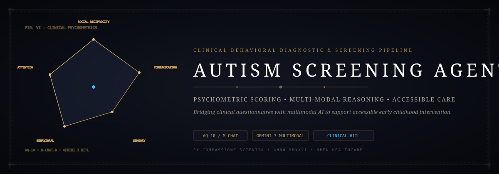

<p align="center">
  
</p>

# 🤖 Autism Screening Agent — Clinical Behavioral Diagnostic Pipeline

[](LICENSE)
[](app.py)
[](autism_web/)
[](autism_ml/)
[](SECURITY.md)

An intelligent, accessible clinical screening pipeline and interactive diagnostic workbench designed for early developmental screening in children. Combines validated psychometric questionnaire scoring (AQ-10 / M-CHAT-R) with multi-modal machine learning and human-in-the-loop clinical review.

Developed by **Jaswanth Reddy ([@Jaswanth1902](https://github.com/Jaswanth1902))** to bridge clinical evaluation waitlists and bring compassionate, objective screening tools to parents and healthcare workers.

---

## 💡 Why Autism Screening Agent?

Early identification of Autism Spectrum Disorder (ASD) dramatically improves childhood developmental interventions. However, families often face 6 to 18-month waitlists for specialized clinical evaluations.

This agent was built to provide an **accessible, objective, and privacy-preserving first line of triage**:
- **Validated Questionnaires**: Digitized, human-friendly AQ-10 and M-CHAT-R scoring protocols.
- **Ensemble Machine Learning**: Pre-trained stacking classifiers analyzing behavioral trait clusters.
- **3-Tier Compassionate Results**:
  - 🟢 **Low Risk**: Reassuring feedback and developmental milestone tracking.
  - 🟡 **Moderate Risk**: Monitoring suggestions and pediatric follow-up prompts.
  - 🟠 **High Risk**: Direct, compassionate guidance to accredited developmental pediatricians.
- **100% Patient Privacy**: Local-first processing; questionnaire answers are never monetized or exfiltrated.

---

## 🏗️ Diagnostic Architecture

```mermaid
flowchart LR
    Caregiver([Caregiver / Clinical User]) --> UI[React 18 Interactive Assessment]
    UI --> Sanitizer[Input Validator & Anonymizer]
    Sanitizer --> Scorer[Deterministic Scoring Engine\n(AQ-10 & M-CHAT-R Algorithms)]
    
    subgraph MLPipeline["Machine Learning Assessment Engine"]
        Scorer --> FeatureExtractor[Trait Cluster Vectorizer]
        FeatureExtractor --> StackingModel[Stacking Classifier\nXGBoost + Random Forest]
        StackingModel --> RiskClassifier[Probabilistic ASD Risk Score]
    end
    
    RiskClassifier --> ClinicalReport[Actionable Diagnostic Report\n+ Local Care Resources]
    ClinicalReport --> UI
```

---

## 🚀 Quick Start & Setup

### 1. Backend Server (Flask)
```bash
pip install -r requirements.txt
python app.py
```

### 2. Frontend Interface (React)
```bash
cd autism_web/autism-website
npm install
npm start
```

Access the screening workbench at `http://localhost:3000`.

---

## 🛡️ Patient Privacy & Clinical Hardening

1. **Zero Personally Identifiable Information (PII)**: The application does not collect child names, addresses, or phone numbers. Only anonymous questionnaire integers are evaluated.
2. **Local Machine Execution**: The entire Flask and ML scoring stack runs strictly on `127.0.0.1`.
3. **Clinical Boundaries**: This tool is an initial behavioral screening instrument, **not a formal medical diagnosis**. It is designed to assist, never replace, certified developmental pediatricians.

See [`SECURITY.md`](SECURITY.md) for vulnerability reporting and privacy disclosures.

---

## 👤 Author & Maintainer

**Jaswanth Reddy**  
- GitHub: [@Jaswanth1902](https://github.com/Jaswanth1902)  
- Email: `jaswanthreddy1537@gmail.com`  

---

## 📄 License

Licensed under the [MIT License](LICENSE).
